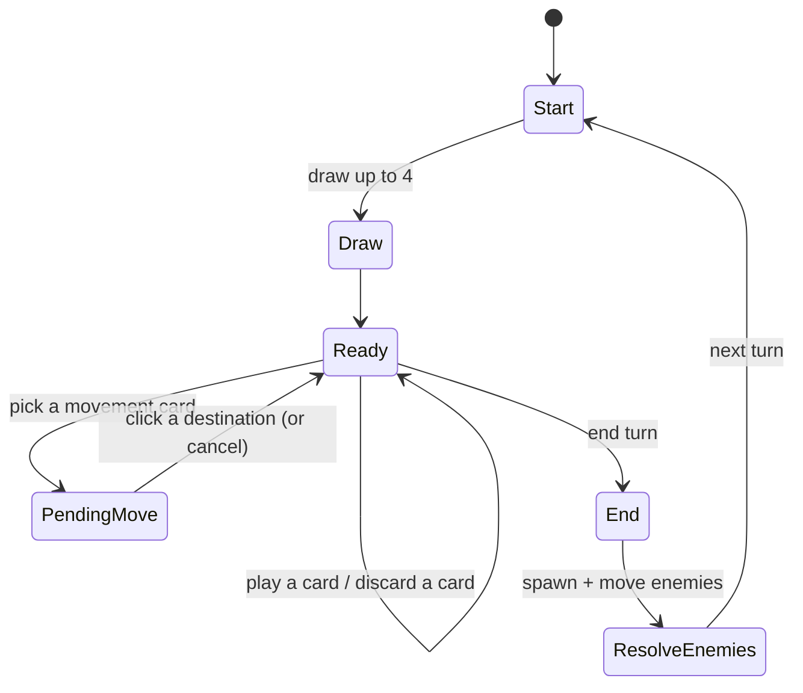

# 04 — Turns, drawing, and movement

**Goal:** the core game loop. Start a turn, draw up to four, play movement cards by
clicking reachable hexes, freely discard, and end the turn. No enemies yet (chapter
07), but the turn counter and end-turn hook exist so they can be plugged in.

## 1. The turn in detail

From the design doc:

- At the start of your turn you draw **up to 4** cards.
- You may play any number of cards (movement, hand management, combat, economy).
- You may **freely discard any number of cards without playing them**, or keep them
  for next turn.
- Ending a turn with **no cards played** grants 1 currency (the anti-softlock rule).
- Reaching the next map section does **not** end the turn.

So a turn is a small state machine over the hand:



`Phase` in `game/state.ts` already has `playing` and `pending-move`. `pending-move`
carries the chosen card plus the set of reachable hexes so the UI can highlight them
without recomputing rules.

## 2. Reachable hexes for a movement mode

`src/game/movement.ts`. A movement card lets you walk **up to** `distance` steps,
where every intermediate hex must be enterable. Breadth-first search from the player
gives exactly the reachable set and the cost (steps) to each:

```ts
import { hexKey, neighbours } from "./hex";
import type { HexCoord } from "./hex";
import { canEnter } from "./terrain";
import type { Terrain } from "./terrain";

export type TerrainLookup = (coord: HexCoord) => Terrain;

/** Map from hex key to the number of steps needed to reach it. */
export function reachableHexes(
  start: HexCoord,
  distance: number,
  cardTerrain: Terrain,
  terrainAt: TerrainLookup,
): Map<string, number> {
  const steps = new Map<string, number>();
  steps.set(hexKey(start), 0);

  let frontier: HexCoord[] = [start];
  for (let step = 1; step <= distance; step += 1) {
    const nextFrontier: HexCoord[] = [];
    for (const current of frontier) {
      for (const candidate of neighbours(current)) {
        const key = hexKey(candidate);
        if (steps.has(key)) {
          continue;
        }
        if (!canEnter(terrainAt(candidate), cardTerrain)) {
          continue;
        }
        steps.set(key, step);
        nextFrontier.push(candidate);
      }
    }
    frontier = nextFrontier;
  }

  return steps;
}
```

Because every step costs 1, BFS gives the true minimum, and the `step`-by-`step`
layer expansion gives you the number of steps as a bonus (useful if you want to tint
nearby hexes differently). `terrainAt` is supplied by whoever owns the map, so this
module stays free of map storage.

> Design decision (flagged in the README): movement is "up to N", so a card that
> lets you move 6 lets you stop after 1. If you instead want "exactly N", reject
> destinations whose `steps` value is not equal to `distance`. One line.

## 3. Applying a move

When the player clicks a highlighted destination, walk the shortest path and move
the player one hex at a time (so the UI can animate). Reuse `findPath` from
`hex.ts`, passing the same passability rule:

```ts
import { equalsHex, findPath } from "./hex";
import { canEnter } from "./terrain";

export function resolveMove(
  from: HexCoord,
  to: HexCoord,
  cardTerrain: Terrain,
  terrainAt: TerrainLookup,
): HexCoord[] {
  const passable = (coord: HexCoord): boolean => canEnter(terrainAt(coord), cardTerrain);
  const path = findPath(from, to, passable);
  if (path.length === 0) {
    throw new Error("unreachable destination");
  }
  return path;
}
```

The move may cross into a new map section; the streaming logic in chapter 06 reacts
to the player's new position after the move completes. The move does **not** end the
turn.

## 4. Hand-management modes

Hand-management cards resolve immediately and never put you in `pending-move`. Each
mode is a pure function over the deck:

```ts
import type { CardMode } from "./cards";
import type { Deck } from "./deck";
import { drawCards, removeFromHand, toDiscard } from "./deck";
import type { Rng } from "./rng";

export function applyHandMode(
  deck: Deck,
  mode: CardMode,
  rng: Rng,
): { deck: Deck; rng: Rng } {
  switch (mode.kind) {
    case "draw": {
      const result = drawCards(deck, mode.count, rng);
      return result;
    }
    case "draw-discard": {
      // Draw first; the player then chooses which cards to discard.
      // Return a pending-discard request to the UI instead of guessing.
      const drawn = drawCards(deck, mode.draw, rng);
      return { deck: drawn.deck, rng: drawn.rng };
    }
    case "discard-hand": {
      if (deck.hand.length < mode.threshold) {
        return { deck, rng };
      }
      const discarded = toDiscard({ ...deck, hand: [] }, deck.hand);
      return drawCards(discarded, mode.draw, rng);
    }
    case "recover": {
      const recovered = deck.discard.slice(-mode.count);
      const remaining = deck.discard.slice(0, deck.discard.length - recovered.length);
      return { deck: { draw: deck.draw, hand: [...deck.hand, ...recovered], discard: remaining }, rng };
    }
    case "move":
    case "attack":
    case "currency":
      throw new Error(`not a hand mode: ${mode.kind}`);
  }
}
```

`draw-discard` needs a second player decision ("discard 2 of the cards you hold"), so
it is the one hand card that needs its own `Phase` variant. Add
`{ kind: "pending-discard"; count: number }` to `Phase` and let the UI collect the
choice, then call `toDiscard`. Chapter 09 covers the selection UI; the rule stays
here.

## 5. Ending the turn and the "no cards played" rule

Track whether any card was played this turn (a boolean on the turn state, not on the
game — reset it in `startTurn`). On end turn:

```ts
export type TurnState = {
  cardsPlayedThisTurn: number;
};

export function endTurnCurrency(turn: TurnState): number {
  return turn.cardsPlayedThisTurn === 0 ? 1 : 0;
}
```

Sequence for "end turn":

1. Grant `endTurnCurrency(turn)` currency (anti-softlock).
2. Advance the turn counter.
3. Run spawn timers and enemy turns (chapter 07) — this is where the player can die.
4. If still alive, `startTurn`: draw up to 4, clear `cardsPlayedThisTurn`.

Because step 3 can end the game, the end-turn transition returns a fresh
`GameState` whose `phase` may be `{ kind: "game-over", reason }`. Keep that as data,
never as a thrown exception.

## 6. Discarding without playing

"Freely discard any number of cards" is not a card effect; it is a direct action
from the UI on the hand. Implement it as one game function so the UI only forwards
intent:

```ts
export function discardFromHand(deck: Deck, card: Card): Deck {
  const without = removeFromHand(deck, card);
  return toDiscard(without, [card]);
}
```

This must **not** count as "playing a card" for the anti-softlock rule — otherwise a
player could farm currency by discarding. Keep the two concepts separate: discarding
touches only the deck; playing touches `cardsPlayedThisTurn` too.

## 7. Wiring it into the UI

Extend `MapView` to also render the player marker and the reachable highlights:

- Draw the player on `map.player`.
- In `phase.kind === "pending-move"`, add a `reachable` class to each highlighting
  hex (a translucent overlay, per the "simple backgrounds, few colours" guideline).
- Clicking the map converts the pointer position to a hex (`pixelToHex`), checks it
  is in the reachable set, and dispatches the move.
- Right-click / Escape cancels back to `playing`.

The click handler does **no** rules: it calls `pixelToHex`, looks up whether the hex
is reachable, and calls the game's move function. All the decision-making lives in
`movement.ts`.

## 8. Milestone

- Start with the 4-card starting deck; draw up to 4 each turn.
- Selecting a grass card highlights every dirt/grass hex within N steps, and clicking
  one walks the player there along a shortest path.
- The card moves to the discard pile; ids and counts update in the HUD.
- Discarding a card by hand does not grant the anti-softlock currency; ending a turn
  without playing does.
- Movement is blocked by water, mountain, and impassible hexes for a grass card.

Next: [Map generation](05-map-generation.md).
