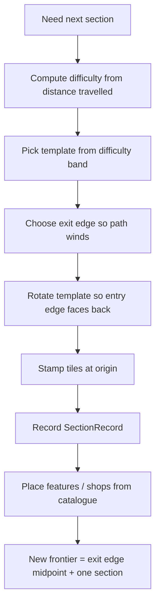

# 05 — Map generation

**Goal:** an endless, winding, difficulty-graded path built by stamping
pre-generated hexagonal **sections** onto the world grid, with upgrades placed
according to the design's terrain rules.

## 1. What a section is

From the design doc:

- The map is a **hex grid** made of winding sections of *hard-coded* tiles.
- Each pre-generated section has a **side length of 4 hexes**.
- Some sections are **2× the size**.
- Each section has a **difficulty**; harder sections appear deeper in.
- Terrain forms a **labyrinth**; a grass path usually follows the outside or winds
  back and forth, forest/water offer shortcuts around upgrades, mountains hide
  rarer upgrades behind a detour.

A hexagon with side length 4 is a hexagon of **radius 3** (a hexagon of radius `n`
has `n+1` hexes per side), containing `3n² + 3n + 1 = 37` hexes. "2× size" is taken
to mean a hexagon of radius 7 (side length 8, 169 hexes) — treat the exact factor as
a tuning knob.

Store the advancing front explicitly. A `SectionRecord` survives even after the
section's tiles are deleted from the world, because the design requires it:

> "the game still keeps track if it's position to prevent the path from winding
> there and reaching that position again."

```ts
export type SectionRecord = {
  id: string;
  difficulty: number;
  /** World coord of the section's centre. */
  origin: HexCoord;
  /** Every hex the section covered, in world coords. Kept after removal. */
  footprint: readonly HexCoord[];
  /** Direction (edge index) the player entered from. */
  entryEdge: number;
  /** Direction the player is meant to leave through. */
  exitEdge: number;
};
```

## 2. Hexagon helpers

Add to `game/hex.ts` (or a new `game/hexagon.ts`):

```ts
import type { HexCoord } from "./hex";

export function hexesInHexagon(radius: number): HexCoord[] {
  const results: HexCoord[] = [];
  for (let q = -radius; q <= radius; q += 1) {
    for (let r = Math.max(-radius, -q - radius); r <= Math.min(radius, -q + radius); r += 1) {
      results.push({ q, r });
    }
  }
  return results;
}

/** Rotate a hex 60° clockwise about the origin. */
export function rotateRight(coord: HexCoord): HexCoord {
  return { q: -coord.r, r: coord.q + coord.r };
}

/** Rotate a hex 60° counter-clockwise about the origin. */
export function rotateLeft(coord: HexCoord): HexCoord {
  return { q: coord.q + coord.r, r: -coord.q };
}

export function rotateTimes(coord: HexCoord, steps: number): HexCoord {
  const turns = ((steps % 6) + 6) % 6;
  if (turns === 0) {
    return coord;
  }
  if (turns <= 3) {
    let result = coord;
    for (let i = 0; i < turns; i += 1) {
      result = rotateRight(result);
    }
    return result;
  }
  let result = coord;
  for (let i = 0; i < 6 - turns; i += 1) {
    result = rotateLeft(result);
  }
  return result;
}
```

## 3. Authoring templates

Author each section as text. One character per hex, using this legend:

| Char | Meaning |
| ---- | ------- |
| `.` | grass (the default walkable spine) |
| `f` | forest |
| `w` | water |
| `m` | mountain |
| `d` | dirt |
| `#` | impassible |
| `S` | shop |
| `T` | smith |
| `R` | remove-a-card space |
| `G` | gain-a-card space |
| `c` | coin |

A radius-3 hexagon's rows have lengths 4, 5, 6, 7, 6, 5, 4 (rows `r = -3 .. 3`),
each shifted so they form the hexagon. `game/map.ts`:

```ts
import { hexKey, neighbours } from "./hex";
import type { HexCoord } from "./hex";
import { hexesInHexagon, rotateTimes } from "./hexagon";
import type { Terrain, Tile, TileFeature } from "./terrain";
import { emptyTile } from "./terrain";
import type { CardSpec } from "./cards";
import type { Rng } from "./rng";
import { pick } from "./rng";

export type SectionTemplate = {
  id: string;
  difficulty: number;
  radius: number;
  rows: readonly string[];       // rows[r + radius], lengths = hexagon row lengths
  /** Authored assassin spawn points, in local hex coords. */
  spawns: readonly SpawnPoint[];
  /** Edge indices (0..5) the player may enter from / leave through. */
  entryEdges: readonly number[];
  exitEdges: readonly number[];
};

/** `delay` = turns after the player enters the section before an assassin appears. */
export type SpawnPoint = { q: number; r: number; delay: number };

const TERRAIN_BY_CHAR: Record<string, Terrain> = {
  ".": "grass", f: "forest", w: "water", m: "mountain", d: "dirt", "#": "impassible",
  S: "grass", T: "grass", R: "grass", G: "grass", c: "grass",
};

const FEATURE_BY_CHAR: Record<string, TileFeature> = {
  ".": { kind: "none" }, f: { kind: "none" }, w: { kind: "none" },
  m: { kind: "none" }, d: { kind: "none" }, "#": { kind: "none" },
  S: { kind: "shop", stock: [], rerollCost: 2 },
  T: { kind: "smith" },
  R: { kind: "remove-card" },
  G: { kind: "gain-card" },
  c: { kind: "coin", value: 3 },
};
```

The shop's stock is filled when the section is *placed* (chapter 08 draws from the
catalogue), not in the template, so `stock: []` here is a placeholder.

Validate templates once at load so a mistyped row fails loudly:

```ts
export function validateTemplate(template: SectionTemplate): void {
  const expected = hexesInHexagon(template.radius);
  const perRow = new Map<number, number>();
  for (const coord of expected) {
    perRow.set(coord.r, (perRow.get(coord.r) ?? 0) + 1);
  }
  if (template.rows.length !== template.radius * 2 + 1) {
    throw new Error(`template ${template.id}: wrong row count`);
  }
  template.rows.forEach((row, index) => {
    const r = index - template.radius;
    if (row.length !== perRow.get(r)) {
      throw new Error(`template ${template.id}: row ${r} has ${row.length}, expected ${perRow.get(r)}`);
    }
  });
}
```

## 4. Stamping a section into the world

Convert template coordinates to world coordinates by rotating with the section's
entry direction and translating to the section origin:

```ts
export function stampSection(
  tiles: Map<string, Tile>,
  template: SectionTemplate,
  origin: HexCoord,
  rotationSteps: number,
): void {
  template.rows.forEach((row, index) => {
    const r = index - template.radius;
    for (let column = 0; column < row.length; column += 1) {
      const local = localCoord(template.radius, r, column);
      const rotated = rotateTimes(local, rotationSteps);
      const world: HexCoord = { q: origin.q + rotated.q, r: origin.r + rotated.r };
      const char = row[column];
      const terrain = TERRAIN_BY_CHAR[char];
      const feature = FEATURE_BY_CHAR[char];
      tiles.set(hexKey(world), {
        terrain,
        feature,
        spawnDelay: -1,
        spawnTurn: -1,
      });
    }
  });

  // Authored spawn points, rotated like the terrain so they follow the section.
  for (const spawn of template.spawns) {
    const rotated = rotateTimes({ q: spawn.q, r: spawn.r }, rotationSteps);
    const world: HexCoord = { q: origin.q + rotated.q, r: origin.r + rotated.r };
    const tile = tiles.get(hexKey(world));
    if (tile !== undefined) {
      tiles.set(hexKey(world), { ...tile, spawnDelay: spawn.delay });
    }
  }
}

/** Column index → axial q for a shifted hexagon row. */
function localCoord(radius: number, r: number, column: number): HexCoord {
  const q = column - radius - Math.min(0, r); // standard hexagon row shear
  return { q, r };
}
```

Assassin spawn points are **authored**, not derived from terrain: each template
carries a `spawns` list of local hex coords and per-point delays. Sections are
grouped into difficulty bands, so the template's `difficulty` and how many points
it carries (and how short their delays are) set the pressure without any per-depth
formula. The level editor paints these points and their delays.

Note the delay is **relative** and `spawnTurn` starts at `-1`: a section is stamped
well before the player reaches it (they are generated ahead, chapter 06), so its
timers must not start yet. `spawnTurn` — the turn the assassin appears — is armed
when the player enters the section.

```ts
export function armSection(
  tiles: ReadonlyMap<string, Tile>,
  section: SectionRecord,
  turn: number,
): Map<string, Tile> {
  const next = new Map(tiles);
  for (const coord of section.footprint) {
    const key = hexKey(coord);
    const tile = next.get(key);
    if (tile === undefined || tile.spawnTurn !== -1 || tile.spawnDelay < 0) {
      continue;
    }
    next.set(key, { ...tile, spawnTurn: turn + tile.spawnDelay });
  }
  return next;
}
```

The first section is armed at generation (the player starts inside it); every other
one when `onPlayerMoved` (chapter 06) crosses into it. The `spawnTurn !== -1` guard
means a section is only ever armed once.

## 5. The generation loop

The map grows toward the **leading edge**, one section at a time. Keep a
`frontier: { origin: HexCoord; entryEdge: number }` describing where the next
section goes.



Key points:

- **Difficulty bands.** Compute `difficulty = clamp(distanceTravelled / tuningK, 0,
  maxBand)`. Filter the template pool to templates whose `difficulty` is within the
  current band (± 1). Later bands include snipers and rarer upgrades.
- **Winding.** From the entry edge, pick an exit edge that is *not* the direct
  opposite (which would make a straight line). The design wants "winding sections";
  require the chord between entry and exit to be at least one edge away from
  straight, then bias toward alternating left/right so the path snakes. The direction
  from one section's centre to the next is the exit edge's neighbour direction,
  scaled by the section diameter.
- **No re-entry.** Before stamping, check the new footprint against every
  `SectionRecord.footprint` already on record (including removed ones). If a rotated
  template would overlap a remembered footprint, try a different exit edge or
  template. This is exactly why records outlive their tiles.
- **Feature placement.** The template already places upgrades relative to terrain
  (mountains hide rares, water/forest guard shortcuts). Additionally, when a
  `shop` feature is stamped, fill its `stock` by drawing from `SHOP_CATALOGUE` with
  rarity weighting (chapter 08).
- **Snipers.** Only place a sniper on sections above a difficulty threshold, at a
  fixed hex the template marks; record its position (chapter 07).

Because all of this is driven by the seeded `Rng` threaded through `pick`, the same
seed always produces the same map — invaluable for debugging and for the tests in
chapter 10.

## 6. Keeping it playable

Two guard rails that save a lot of pain:

- **Always stamp before you need it.** Generate the section ahead of the player, so
  the leading two rows exist the moment they become visible (chapter 06).
- **Assert connectivity.** After stamping, run `findPath` from the section's entry
  hex to its exit hex using the *starting deck's* terrains (grass + forest). If no
  path exists, the section is a dead end for an early player; reject it and retry
  with another template/rotation. Cheap to check, and it makes hand-authored
  templates trustworthy.

## 7. Milestone

- A fixed seed produces a deterministic chain of sections that winds left and right.
- Each section is 37 hexes (or 169 for the 2× ones) with no overlaps.
- Difficulty ramps with distance; early sections contain only easy upgrades, later
  ones contain harder features.
- A `findPath` from entry to exit is possible for the starting terrains in every
  generated section.

Next: [Fog of war & tile streaming](06-fog-of-war.md).
